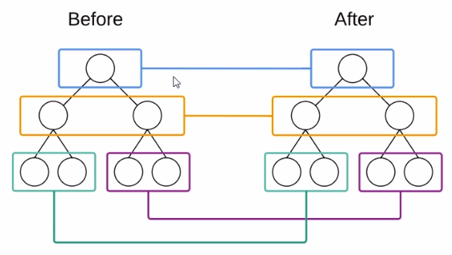
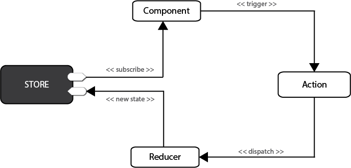

# 自己动手搭建 react 项目

## 先安装基础包

- cnpm i webpack webpack-cli webpack-dev-server babel-loader @babel/core @babel/presets-env @babel/plugin-transform-react-jsx html-webpack-plugin -D
- cnpm react react-dom redux react-router -S

创建`.babelrc`

内容:

{
    "presets": ["babel-presets-env"],
    "plugins": ["@babel/plugin-transform-react-jsx"]
}

创建`.gitignore`    内容:  /node_modules

## 踩过的坑:

1. events.js:183  throw er; // Unhandled 'error' event

未知错误...我都是linux系统,因为监控文件数量过多超过系统设定.修改 /ect/sysctl.conf  `fs.inotify.max_user_watches=524288`  重启搞定

# React 讲解

## 虚拟DOM & DIFF 算法

>  虚拟DOM是react首先提出的概念, 因为原生DOM过于庞大,操作代价高,所以facebook提出使用**JS对象**来描述DOM
>
> 用于实现**高效DOM更新**(按需渲染页面)
>
> **怎么按需:** 获取 DOM 树, 新旧两棵 DOM 树, 对比, 只修改不同
>
> 浏览器并没有提供 DOM tree API, React 使用**JS 对象**模拟 新旧 DOM 树
>
> 这个JS对象就叫虚拟DOM

**那什么是 diff 算法呢: (differ)**

虽然使用了虚拟DOM, 但还是不够高效, 所以React使用了diff算法

> 三个概念:
>
> tree diff : 新旧DOM tree 逐层对比的过程, 整个DOM树对比完成后,找到需要更新的元素
>
> component diff : React 组件级别的对比
>
> > 若组件类型不变, 则认为组件**暂时**不需要更新, 并进行 element diff 对比
> >
> > 若改变,则移除旧组件, 创建并插入新组件
>
> element diff : 元素级别的对比



## React 生命周期


React生命周期分为三个步骤: **创建挂载, 运行更新, 销毁**

每一个步骤对应will和did钩子函数

- 挂载 ---- 一辈子只执行一次
  - componentWillMount()
  - render()
  - componentDidMount()
- 更新 ---- 按需执行多次
  - componentWillReceiveProps()
  - shouldComponentUpdate()
  - componentWillUpdate()
  - render()
  - componentDidUpdate()
- 销毁 ---- 只执行一次
  - componentWillUnmount()

## 唯一数据源

数据源的话,有props和state, 如果把props保存到state, 就不是唯一数据源, 虽然props更新了, 但是组件本身state没有更新

这样的组件叫做受控组件

## Redux

### 基本概念: 

在redux中, 所有的数据保存在一个叫`store`的容器中, **并且一个程序只能有一个store, 不能有多个**, store本质上是一个状态树, 保存了所有数据的状态, 任何组件可以直接从store获取数据. 如果想要改变状态, 需分发一个  `action`, 分发的意思是把可执行信息发送给store, 当一个store接收到action, 它将把这个action代理给相关的`reducer`, reducer是一个纯函数, 它可以查看之前的状态, 并执行action, 然后返回新的状态

**Redux只允许数据单向流动**



### store.js 负责创建一个 store

```js
import { createStore } from 'redux'
import rootReducer from './reducers'

const store = createStore(rootReudcer)

export default store
```


### reducers.js 负责创建 reducers

```js
import { combineReducers } from 'redux'

let defaultState = {
  // ...
}

const counter = (state = defaultState, action) => {
  switch (action.type) {
    case '...':
      // ...
      break
  }
}

const rootReducer = combineReducers({ // 接受一个对象
  counter
})

export default rootReducer
```


### actions.js 负责保存 action

```js
import * as actionTypes from './actionTypes'

export const action = {
  state: {
    // ...
  },
  type: actionTypes.//...
}
```


### actionTypes.js 负责保存 actionTypes 

>  因为actionTypes是字符串,并且派发,判断都需要使用, 很可能造成问题,并且不好排查, 所以单独抽离从来

```js
export const type1 = '...'
// ...
```

### 基本使用

```jsx
import React, { Component, Fragment } from 'react'

import store from './redux/store' // 导入store
import { action } from './redux/actions'


class App extends Component {
  constructor(props) {
    super(props)
    this.state = store.getState() // 获取store内容,并保存为组件state
  }
  
  handleClick = () => {
    store.dispatch({
      state: {},
      type: ''
    })
  }
  
  render () {
    return (
    	<Fragment>
      	<button onClick={this.handleClick}></button>
      </Fragment>
    )
  }
}
```

### 使用 react-redux 连接 redux

```js

```


### redux-thunk 构建异步 action

> 因为flux规范规定action只能是对象, 所以使用中间件redux-thunk来处理异步请求


## Mobx

相对Redux来说


## React 部分原理

### setState() 做了什么

1. 首先, setState是一个异步操作, setState的调用并不会立即引起state的改变
2. 如果在一个函数里面多次调用state, 结果并不是你预期那样, setState可能会导致DOM重绘, 如果每一次调用都直接执行的话, 会造成性能损失, 多次调用setState会合并
3. 

## React-router

1. 和vue-router不一样, vue-router是配置路由, react-router更像管理组件, 把需要路由的组件导入到一个文件, 内部有路由的显示逻辑, 所以不需要类似router-view标签


# React 新技术

## Fiber


## Hooks

### 三个核心API

useState, useEffect, useContext

- useState

基本使用: 

```jsx
import { useState, Fragment } from 'react'
import { Button } from 'antd'

const UseHooks_State = () => {
  const [count, setCount] = useState(0) // count初始值为0, 然后每一次重新渲染都会获取到新的值, 比如+1后渲染, count 是 1, 就得到 1, 这个值由React保管
  // ... useState可以多次调用, 设置多个值
  return (
    <Fragment>
    	<Button onClick={count => setCount(count + 1)}> + 1 </Button>
    	{ count }
      <Button onClick={count => setCount(count - 1)}> - 1 </Button>
    </Fragment>
  )
}

export default UseHooks_State
```

- useReducer `useState的对象版本`

```jsx
import { Fragment, useState, useEffect } from 'react'
import { Button } from 'antd'

function reducer (state, action) { // 是不是很眼熟Redux
  switch (action.type) {
    case 'up':
      return { count: state.count + 1 }
    case 'down':
      return { count: state.count - 1 }
  }
}

const UseHooks_Reducer = () => {
  const [state, dispatch] = useReducer(reducer, { count: 1 }) // 使用useReducer
  
  return (
    <Fragment>
    	<Button onClick={() => {dispatch({ type: 'up' })}}> + 1 </Button>
      { state.count }
			<Button onClick={() => {dispatch({ type: 'down' })}}> - 1 </Button>
    </Fragment>
  )
}

export default UseHooks_Reducer
```

- useEffect !!!!!!!

> useEffect 是用于处理各种状态变化造成的副作用, 也就是说在特定的时刻, 才会执行相应的逻辑

在编写组件的时候, 我们会使用生命周期函数来处理副作用操作, 比如ajax获取数据

有了 useEffect, 什么都不怕了

```jsx
import { useState, useEffect } from 'react'
import { Button } from 'antd'

const UseHooks_Effect = () => {
  const [count, setCount] = useState(0)
  
  useEffect(() => {
    document.title = `You have Clicked ${count} times}`
  }, [count]) // useEffect默认在每一次重新渲染的时候都会执行, 第二个参数可以控制(当第二个参数变化时执行)
  
  return (
  	<Fragment>
    	<Button onClick={() => {dispatch({ type: 'up' })}}> + 1 </Button>
      { count }
			<Button onClick={() => {dispatch({ type: 'down' })}}> - 1 </Button>
    </Fragment>
  )
}
```

### 使用Hooks写自定义的hooks——真香

```jsx
// 判断用户在线

import { useState, useEffect } from 'react'

function useFriendStatus(friendID) {
  const [isOnline, setIsOnline] = useState(null)
  
  function handleStatusChange(status) {
    setIsOnline(status.isOnline)
  }
  
  useEffect(() => {
    ChatAPI.subscribeToFriendStatus(friendID, handleStatusChange)
    return () => {
      ChatAPI.unsubscribeFromFriendStatus(friendID, handleStatusChange)
    }
  })
  
  return isOnline
}
```


