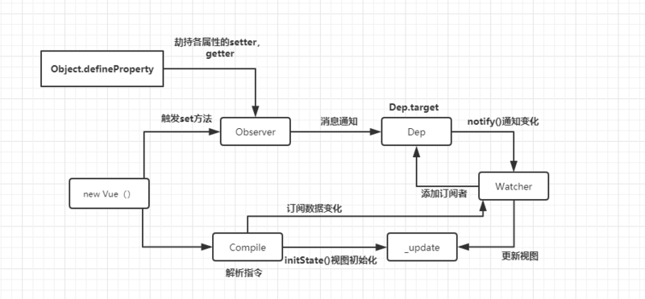

## Vue

渐进式: 核心库和业务库分离

1. computed和watch区别
Computed: 可以关联多个实时计算的对象，当这些对象中的其中一个改变时都会触发这个属性。具有缓存能力，所以只有当数据再次改变时才会重新渲染，否则就会直接拿取缓存中的数据。
Watch：当你需要在数据变化响应时，执行异步操作，或高性能消耗的操作，自定义 watcher 的方式就会很有帮助。


##　关于MVVM的理解
1. 数据代理

2. 双向数据绑定

3. 模板解析

## 不用vue-cli搭建vue项目

## 组件传值


## Vue 生命周期(函数) Vue的是Before..,React的是Will..不能记混了!!!!

- beforeCtreate
  - 刚准备创建vue实例对象, 不能访问data, methods
- created
  - data和methods创建完成
  - 经常发起ajax请求获取数据
- beforeMount
  - 虚拟DOM还没渲染到页面上
- mounted
  - 组件创建的最后一个生命周期, 进行完毕后就到了运行中的阶段
  - 如果用到了UI插件, 那么在mounted内初始化插件
- beforeUpdate
  - data变化的时候触发, 有选择的触发
- updated
  - 更新完毕
- beforeDestroy
  - $destroy被调用的时候被触发
- destroyed
  - 组件被销毁


## vue-router
### 路由基本使用
1. cnpm i vue-router

2. 在 `src` 里面创建 route 文件夹, 并创建index.js文件

3. ```js
   import VueRouter from 'vue-router'
   // 导入需要路由导航的组件
   
   const routes = [
       {
           path: '路径',
           component: '组件名称',
           
       }
   ]
   const route = new VueRouter(routes);
   export default route
   ```

4. 在src里面的index.js添加以下内容

   ```js
   import VueRouter from 'vue-router'
   import route from './route/index.js'
   
   Vue.use(VueRouter)
   
   new Vue({
       // ...
       route
   })
   ```

### 路由嵌套

```js
const routes = [
    {
        path: '路径',
        component: '组件名称',
        childrens: [
            {
                path: '',s
                component: ''
            }
        ]
    }
]
```

### 路由传参

```js
const routes = [
    {
        path: '路径/:id',
        component: '组件名称',
    }
]
```

然后在组件内, 可以利用 `$route.params.id` 访问到id的值

### 路由守卫

#### 全局守卫


#### 独享守卫


#### 组件内守卫


## vuex

Vuex 并不限制你的代码结构。但是，它规定了一些需要遵守的规则：

- 应用层级的状态应该集中到单个 store 对象中。

- 提交 mutation 是更改状态的唯一方法，并且这个过程是同步的。

- 异步逻辑都应该封装到 action 里面。


##  微重构


## new Vue()发生了什么




new Vue() -> 触发Observer来设置getter和setter监听属性, watcher给数据添加订阅者

另一方面Complie去获取页面数据, 订阅数据变化, 并渲染成vDom(虚拟dom), 最后更新视图


## 一些经验

1. 异步props

使用v-if判断是否获取数据, 如果获取了数据才去渲染子组件, 这样子组件就能获取到异步的prop值了


